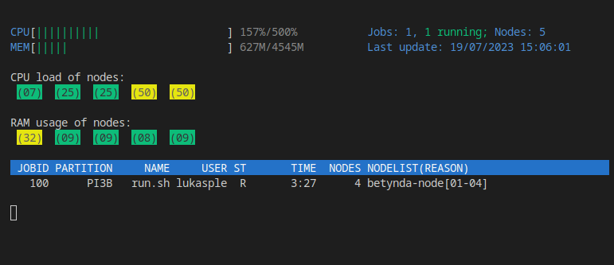

# Slurm htop (shtop)



Simple tui slurm job viewer. Using `/etc/hosts` and `ssh` to get CPU and RAM utilization of all cluster nodes.
Distrubuted using PIP and writen in python.

### Install

`pip install shtop`

### Before running

Make sure if you have all slurm nodes in `/etc/hosts` with `# slurm` header

```
# slurm cluster
192.0.0.0        betynda-login01
192.0.0.1        betynda-node01
192.0.0.2        betynda-node02
192.0.0.3        betynda-node03
192.0.0.4        betynda-node04
```

then make sure if you manualy ssh on all nodes and you have added nodes keys to knowed (by ssh to all hosts). 

### Running

simple write `shtop`